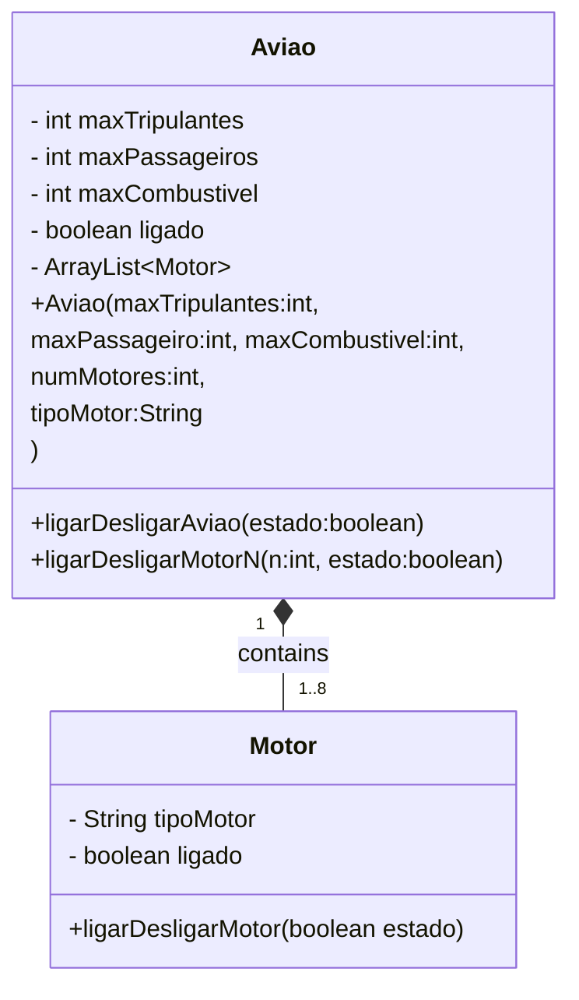

```mermaid
classDiagram

class Aviao{

    - int maxTripulantes
    - int maxPassageiros
    - int maxCombustivel
    - boolean ligado
    - ArrayList~Motor~
  

    +Aviao(maxTripulantes:int,
    maxPassageiro:int, maxCombustivel:int,
    numMotores:int,
    tipoMotor:String
    )

    +ligarDesligarAviao(estado:boolean)
    
    +ligarDesligarMotorN(n:int, estado:boolean)
   
}

class Motor{
    - String tipoMotor
    - boolean ligado

    +ligarDesligarMotor(boolean estado)
    
}

Aviao "1" *-- "1..8" Motor : contains

```