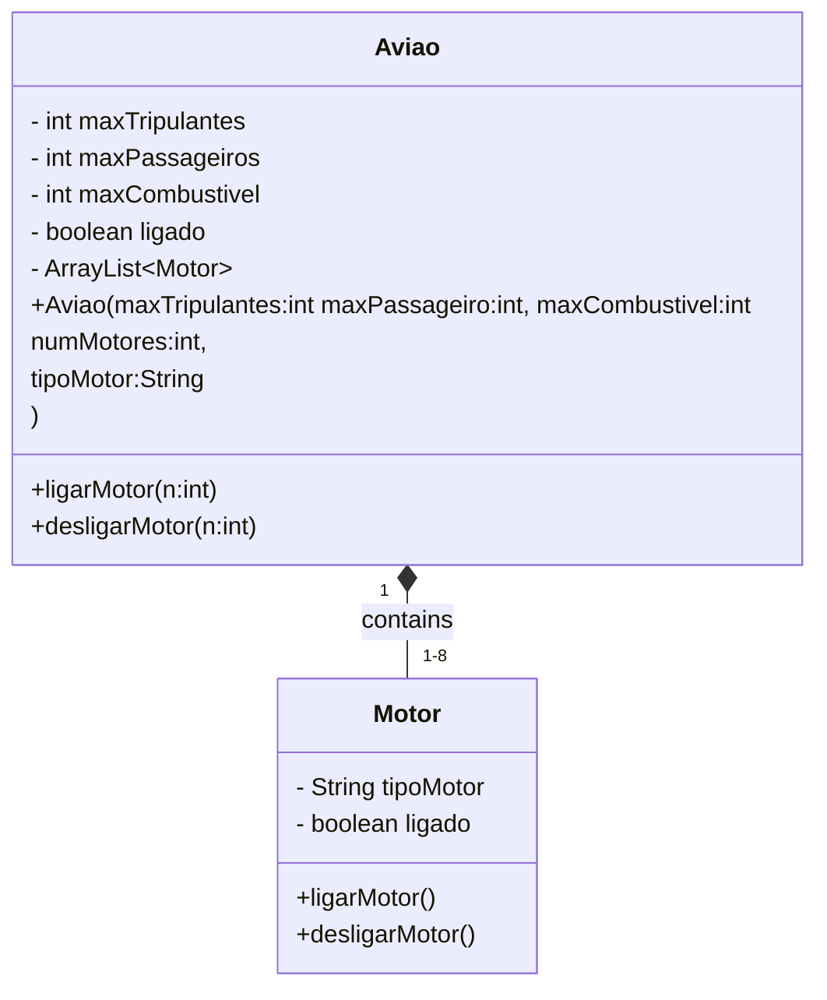

```mermaid
classDiagram

class Aviao{

    - int maxTripulantes
    - int maxPassageiros
    - int maxCombustivel
    - boolean ligado
    - ArrayList~Motor~
  

    +Aviao(maxTripulantes:int maxPassageiro:int, maxCombustivel:int
    numMotores:int,
    tipoMotor:String
    )

    +ligarMotor(n:int)
    +desligarMotor(n:int)
}

class Motor{
    - String tipoMotor
    - boolean ligado

    +ligarMotor()
    +desligarMotor()

    

}

Aviao "1" *-- "1-8" Motor : contains

```