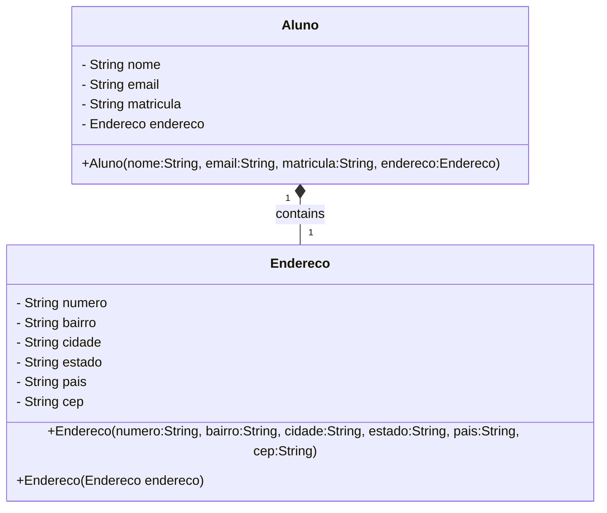

```mermaid
classDiagram

class Aluno{
    - String nome
    - String email
    - String matricula
    - Endereco endereco

    +Aluno(nome:String, email:String, matricula:String, endereco:Endereco)
}

class Endereco{
    - String numero
    - String bairro
    - String cidade
    - String estado
    - String pais
    - String cep

    +Endereco(numero:String, bairro:String, cidade:String, estado:String, pais:String, cep:String)
    
    +Endereco(Endereco endereco)
}


Aluno "1" *-- "1" Endereco : contains
```