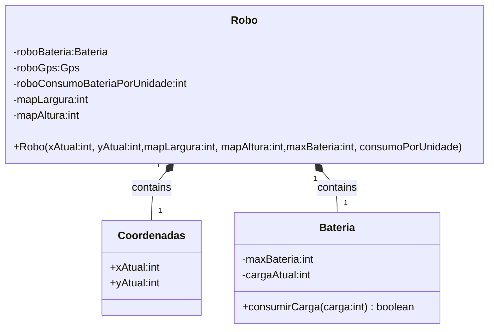

```mermaid
classDiagram

class Robo{

    -roboBateria:Bateria
    -roboGps:Gps
    -roboConsumoBateriaPorUnidade:int
    -mapLargura:int
    -mapAltura:int
    +Robo(xAtual:int, yAtual:int,mapLargura:int, mapAltura:int,maxBateria:int, consumoPorUnidade)

}

class Coordenadas{
    
    +xAtual:int
    +yAtual:int
}

class Bateria{
    -maxBateria:int
    -cargaAtual:int
    
    +consumirCarga(carga:int) boolean
    
}


Robo "1" *-- "1" Coordenadas : contains
Robo "1" *-- "1" Bateria : contains


```