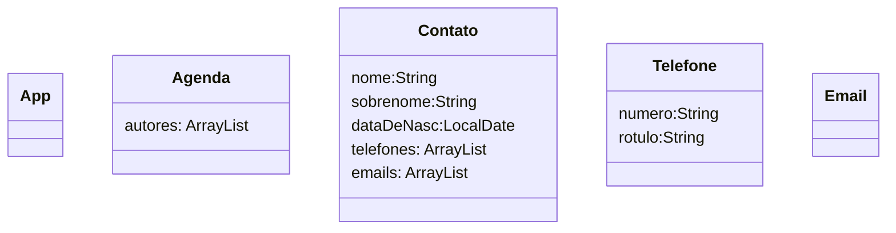

```mermaid
classDiagram

class App{
    
}
class Agenda{
    
    autores: ArrayList<Contato>
    
}

class Contato{
    nome:String
    sobrenome:String
    dataDeNasc:LocalDate
    telefones: ArrayList<Telefone>
    emails: ArrayList<Email>
}

class Telefone{
    numero:String
    rotulo:String
}

class Email{

}

```