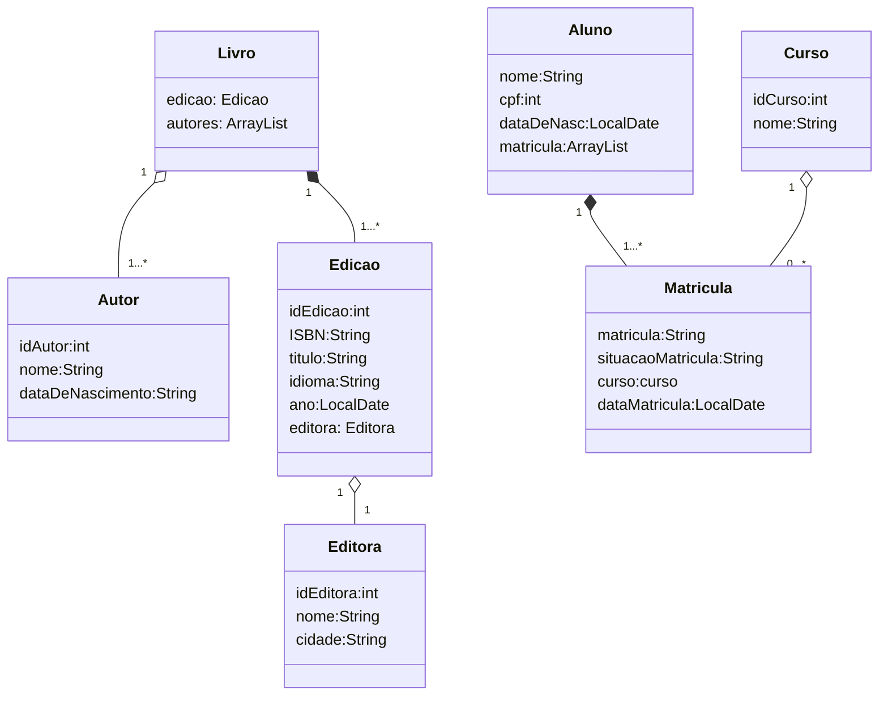

```mermaid
classDiagram

class Livro{
    edicao: Edicao
    autores: ArrayList<Autor>
    

}

class Editora{
    idEditora:int
    nome:String
    cidade:String
      
}

class Autor{
    idAutor:int
    nome:String
    dataDeNascimento:String
  
}

class Edicao{
    idEdicao:int
    ISBN:String
    titulo:String
    idioma:String
    ano:LocalDate
    editora: Editora

}


Livro "1"  o-- "1...*" Autor 
Livro "1" *-- "1...*" Edicao 
Edicao "1" o-- "1" Editora  


class Aluno{
    nome:String
    cpf:int
    dataDeNasc:LocalDate
    matricula:ArrayList<Matricula>

}

class Matricula{
    matricula:String
    situacaoMatricula:String
    curso:curso
    dataMatricula:LocalDate

}

class Curso{
    idCurso:int
    nome:String
}


Aluno "1"  *-- "1...*" Matricula 
Curso "1" o-- "0...*" Matricula 


```