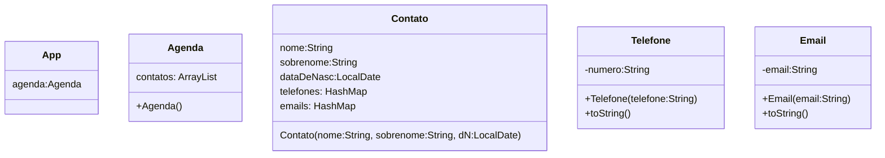

```mermaid
classDiagram

class App{
    agenda:Agenda
    
}
class Agenda{
    
    contatos: ArrayList<Contato>
    +Agenda()
    
}

class Contato{
    nome:String
    sobrenome:String
    dataDeNasc:LocalDate
    telefones: HashMap<String><Telefone>
    emails: HashMap<String><Email>
    Contato(nome:String, sobrenome:String, dN:LocalDate)
}

class Telefone{
    -numero:String
    +Telefone(telefone:String)
    +toString()
}

class Email{
    -email:String
    +Email(email:String)
    +toString()

}

```