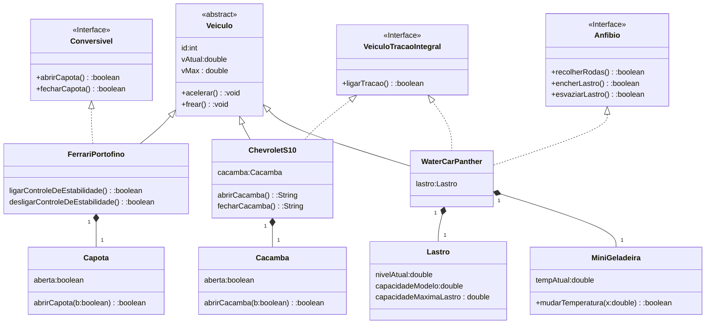

```mermaid

classDiagram


    class Veiculo{
        <<abstract>>
        id:int
        vAtual:double
        vMax : double
        +acelerar():void
        +frear():void
    }

    class Anfibio{
        <<Interface>>
        
        +recolherRodas():boolean
        +encherLastro():boolean
        +esvaziarLastro():boolean


    }

    class Lastro{
        nivelAtual:double
        capacidadeModelo:double
        capacidadeMaximaLastro : double
    }

    class Cacamba{
        aberta:boolean
        abrirCacamba(b:boolean):boolean

    }

    class Capota{
        aberta:boolean
        abrirCapota(b:boolean):boolean

    }


    class MiniGeladeira{
        tempAtual:double
        +mudarTemperatura(x:double):boolean
        
    }

    class Conversivel{
        <<Interface>>
        +abrirCapota():boolean
        +fecharCapota():boolean

    }

    class VeiculoTracaoIntegral{
        <<Interface>>
        +ligarTracao():boolean
    }

    class FerrariPortofino{
        
        
        ligarControleDeEstabilidade():boolean
        desligarControleDeEstabilidade():boolean

    }

    class ChevroletS10{
        cacamba:Cacamba
        abrirCacamba():String
        fecharCacamba():String
    }

    class WaterCarPanther{
        lastro:Lastro


    }


FerrariPortofino "1" *-- "1" Capota
Veiculo <|-- FerrariPortofino
Conversivel <|.. FerrariPortofino


ChevroletS10 "1" *-- "1" Cacamba
Veiculo <|-- ChevroletS10
VeiculoTracaoIntegral <|.. ChevroletS10


WaterCarPanther "1" *-- "1" Lastro
WaterCarPanther "1" *-- "1" MiniGeladeira

Veiculo <|-- WaterCarPanther
VeiculoTracaoIntegral <|.. WaterCarPanther
Anfibio <|.. WaterCarPanther


```